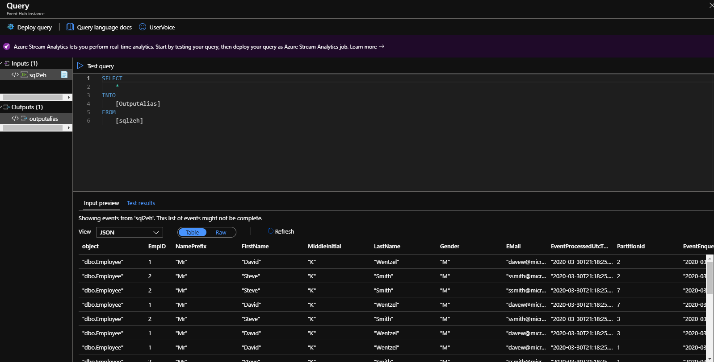

## SQL-to-EH

This repo demos how to get changes from SQL Server published to an EH.  We take the data and then land it to a data lake.  We use python to extract the data every x mins from SQL Server.  The tables we care about are stored in a metadata table that tracks the Change Tracking information.  Every python run finds the latest changed data since the previous run.  

This is not complete. 

## Assumptions

* all SQL tables need a PK
* we don't send deletes to EH
* this is not fully transactional, but it is idempotent and it follows "at-least-once" semantics
* for initial data loads of a table just set metadata entry to `LastSyncVersion = -1`
  * note that we will send batches of rows per EH message and that param is set in `sql2eh.py`
* EH message size is about 1M.  We don't want to send one row/msg nor do we want to send "too many" rows and violate the 1MB limit.  For now this is set to send 10 rows/msg (as array of JSON).  This can be changed.  Perhaps it should be changed in the metadata table so we can set this on a per table basis?  This would solve:
  * highly active, but narrow tables would be batched up efficiently
  * huge tables don't risk overflowing a message


## TODO:

* EH setup scripts
* [manual process finding table primary keys needs fixing](./sql/04-updater-queries.sql)
* python code:
  * probably better if this was in a container and not straight up python due to the sql driver 13/17 issues
* everything pushes to partition 0, put that in the metadata maybe?


## Setup EH

* need a EH.  
  * Standard
  * everything else is optional.  
  * setup a policy for manage
  * two consumer groups:
    * debug
    * datalake

Note connstring info here (this must be to the EH _not_ the namespace):

Mine:  
`Endpoint=sb://davewdataeng.servicebus.windows.net/;SharedAccessKeyName=mypolicy;SharedAccessKey=78k4G4aL26NmSjEtqZQPS7w26H1XDSVnzhooublUzeQ=;EntityPath=sql2eh`


## Setup SQL

We will use a SQL Server that has Change Tracking enabled .  

Here are the sample scripts, adjust accordingly:

* [Create Sample Items](./sql/01-sample.sql) 
  * these are the objects I'm replicating
* [Setup SQL](./sql/02-setup-sql.sql)
  * sets up CT and the metadata objects
* [Add tables to CT](./sql/03-add-tables.sql)
  * add your tables that you want to "replicate" to the metadata
* [Add the Updater queries to the metadata](./sql/04-updater-queries.sql)
  * this is a manual process for now.  This writes the queries that the python uses to the metadata.  
  * these queries determine what data has changed since the last time we polled
* [metadata.GetLatestTableData](metadata.GetLatestTableData.sql)
  * gets the latest data for the given table
* [metadata.SetLastSyncVersion](metadata.SetLastSyncVersion.sql)

## Setup Python

This is designed to run on-prem.  It does the following:
* Connect to SQL
* figure out what data has changed in the tables specified in the metadata
* wrap that data into an EH message and push the message

I do everything in bash/wsll/ubuntu, here's the steps:

```bash

mkdir -p pysql2eh
cd pysql2eh
python3.6 -m venv .venv
source .venv/bin/activate

# if this generates errors then 
# sudo nano /etc/odbcinst.ini
# clear the file and rerun
sudo apt-get install msodbcsql17


pip install pandas
pip install --upgrade pyodbc --no-cache-dir
pip install azure-eventhub


pip freeze >> requirements.txt


```

Here's the actual python code:    

[sql2eh.py](./py/sql2eh.py)


## Running the Demo

1. Get everything setup above
2. change any connstrings as needed in `config.json`
3. Run the code. 

```bash
python ./py/sql2eh.py

```

## Testing (Running a Consumer)

Easiest way is to go to EH and find the "Process Data" option.  This is a mini Azure Stream Analytics.  Have the consumer run a few times and you should see the output.  The last 3 columns will also show the EvnetProcessedUtcTime, PartitionId, and EventEnqueuedUtcTime.  

It should look like this:




Example unit testing items (manual for now) can be found in `metadata.GetLatestTableData`.  